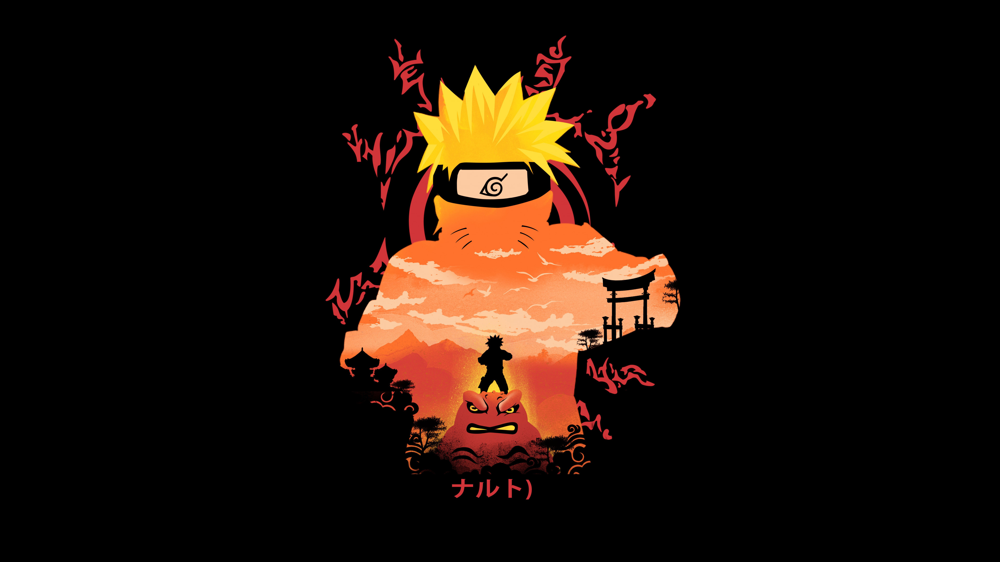

# Heróis vs Vilões ⚔️🦸‍♂️🦹‍♀️

Neste minigame inspirado no universo **Naruto**, você precisa montar seu time de heróis e enfrentar os maiores vilões da história! Será que você consegue vencer esse embate épico?

🚀 **Acesse o projeto online:** [Clique aqui](https://gabrielcotrimmiron.github.io/herois-vs-viloes/)  

---

## 📌 Como Funciona?

- O jogador deve escolher **3 heróis** do universo Naruto.  
- **Vilões são proibidos!** Se tentar selecionar um, será alertado.  
- Cada herói e vilão recebe uma força aleatória (de 1 a 10).  
- Um time de **3 vilões aleatórios** é gerado automaticamente.  
- No final, os times se enfrentam e vence quem tiver maior força total!

---

## 🛠 Tecnologias Usadas

- **HTML**  
- **CSS**  
- **JavaScript**

---

## 🎯 Implementações Extras

- ✅ Validação contra escolha de personagens vilões.   
- ✅ Prevenção de personagens repetidos no time.  
- ✅ Interface estilizada com ambientação temática de batalha.  
- ✅ Feedback visual e interativo com alertas e animações.

---

💡 **Este projeto foi desenvolvido durante a Imersão Dev da Alura, com adaptações e melhorias feitas para deixar a experiência mais divertida e interativa.**

---

📧 **Contato:** gabrielcmiron@gmail.com
